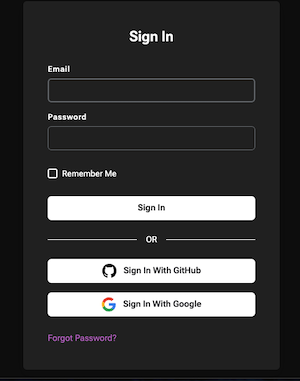
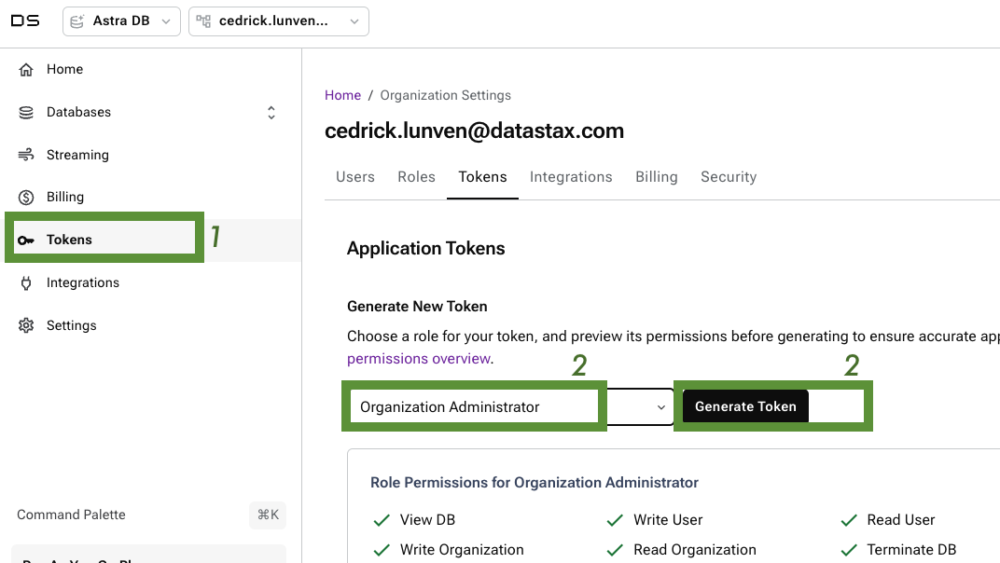
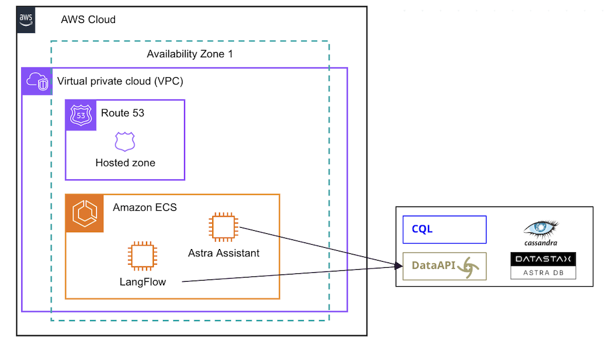
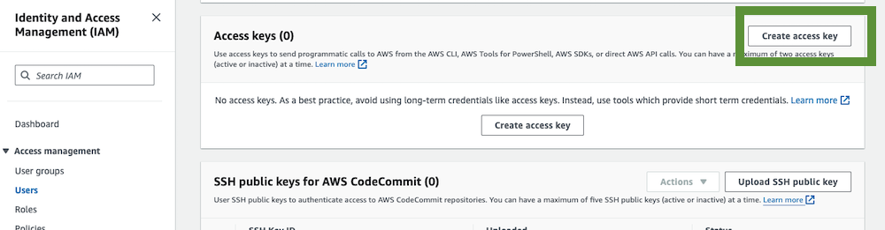
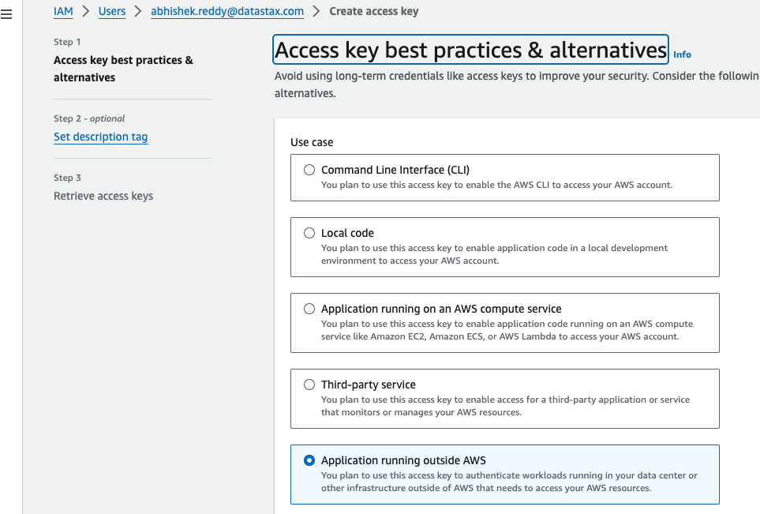

## Terraform Providers for RagStack AI

## Table of content

1. [Overview](#1-overview)
2. [Installation and Prerequisites](#2-installation-and-prerequisites)
3. [AWS Deployments]()
4. [GCP Deployments]()
5. [Azure Deployments]()

## 1. Overview

Terraform module which helps you quickly deploy an opinionated AI/RAG stack to AWS, provided by Datastax.

## 2. Installation and Prerequisites

### 2.1 - Terraform Installation

> Note: Check [Terraform Documentation](https://developer.hashicorp.com/terraform/install)


- ✅ `2.1.a` **Update Homebrew**: Before installing any new package, it's good practice to update Homebrew:

```sh
brew update
```

- ✅ `2.1.b` **Install Terraform**: To install Terraform using Homebrew, run the following command:

```sh
brew tap hashicorp/tap
brew install hashicorp/tap/terraform
```

- ✅ `2.1.c` **Verification**; After the installation completes, verify that Terraform is installed correctly by checking its version:

```sh
terraform -v
```

### 2.2 - Astra CLI Installation

Astra CLI is a command-line interface (CLI) tool that enables users to interact with and manage the 
Astra database-as-a-service platform. It provides developers with a streamlined way to create, configure, and 
manipulate databases, making it easier to integrate Astra into their applications and workflows.

Astra CLI goes beyond basic database management by facilitating the seamless integration of external tools like **dsbulk**, 
**cqlsh**, and **pulshar-shell** or by providing useful shortcuts like **dotenv** file generation.

- ✅ `2.2.a` **Update Homebrew**: Before installing any new package, it's good practice to update Homebrew:

```sh
brew update
```

- ✅ `2.2.b` **Install Astra CLI**: To install Terraform using Homebrew, run the following command:

```sh
brew install datastax/astra-cli/astra-cli
```

- ✅ `2.2.c` Connect to [https://astra.datastax.com](https://astra.datastax.com)



- ✅ `2.2.d` Navigate to token and generate a token with `Organization Administrator` permissions and copy the token starting by `AstraCS:...`



> Note:
>
> `osx` is based on a linux kernel and can run shell scripts. Files are
> installed in `/usr/local/Cellar/astra-cli/<version>` and linked with a 
> symbolic link to `/usr/local/bin/astra`. The configuration of the CLI is 
> stored in `~/.astrarc` - **It is not lost on updates

- ✅ `2.2.e` - Issue `setup` command and provide your token as an input. It must start by `AstraCS:...`. Make sure to have the `Organization Administrator` role to avoid any permission limitations later on.

```sh
astra setup --token AstraCS...
```

- ✅ `2.2.f` - Display your local configuration list, validating setup is complete. 

```bash
astra config list
```

- ✅ `2.2.g` - Create a `vector database` with the CLI

```bash
astra db create terraform_demo --vector --async
```

- ✅ `2.2.h` - You can see it pending with 

```bash
astra db list
```

```console
+---------------------+--------------------------------------+-----------+-------+---+-----------+
| Name                | id                                   | Regions   | Cloud | V | Status    |
+---------------------+--------------------------------------+-----------+-------+---+-----------+
| terraform_demo      | 2753308c-34bc-4bff-ab87-0ff3f2218fa3 | us-east1  | gcp   | ■ | PENDING   |
+---------------------+--------------------------------------+-----------+-------+---+-----------+
```

### 2.d Get the sample project

```
git clone git@github.com:datastax/terraform-datastax-ai-stack.git
```

## 3. AWS Deployment



### 3.1 AWS Credentials

- ✅ `3.1.a` - Access the Idenity and Access Management console (IAM) in AWS

- ✅ `3.1.b` - Create a an User with AWS and add the different permissions. 

- ✅ `3.1.c` - For this user create a pair of keys wih `access_key` and `secret_key` as follows:



- ✅ `3.1.d` - Setup the access for an application outside



### 3.2 AWS CLI

- ✅ `3.2.a` - Installing AWS CLI

```bash
curl "https://awscli.amazonaws.com/AWSCLIV2.pkg" -o "AWSCLIV2.pkg"
$ sudo installer -pkg AWSCLIV2.pkg -target /
```

- ✅ `3.2.b` - Setup AWS CLI (short term)

```bash
touch ~/.aws/credentials
vi ~/.aws/credentials
```
- Populate the configuration file with your credentials

```ini
[default] 
aws_access_key_id = replace 
aws_secret_access_key = replace/K7MDENG/bPxRfiCYEXAMPLEKEY
aws_session_token = replace
```

- ✅ `3.2.c` -Verify the cli is install

```bash
aws --version
```

- Configure your profile

```
aws configure list-profiles
aws configure list --profile default
```

```
      Name                    Value             Type    Location
      ----                    -----             ----    --------
   profile                  default                  manual    --profile
access_key     ****************JR3H shared-credentials-file    
secret_key     ****************c319 shared-credentials-file    
```

### 3.3 Init Terraform

- ✅ `3.3.a` -Update `terraform.tf` as follows (filtering only AWS)

```typesafe
terraform {
  required_providers {
    astra = {
      source  = "datastax/astra"
      version = "~> 2.3.3"
    }
    aws = {
      source  = "hashicorp/aws"
      version = "~> 5.47.0"
    }
  }
}
```


- ✅ `3.3.b` - Update `input.tf` as follows (selecting AWS)

```console
variable "astra_token" {
  type = string
}

variable "aws_profile" {
  type     = string
  nullable = true
  default  = null
}
```

- ✅ `3.3.c` - Initialization

```bash
cd demo-aws
terraform init
```

Output
```
Initializing the backend...
Initializing modules...
- datastax-ai-stack-aws in aws
- datastax-ai-stack-aws.assistants in aws/modules/assistants
- datastax-ai-stack-aws.assistants.assistants_api_db in aws/modules/astra_db
- datastax-ai-stack-aws.assistants.ecs_deployment in aws/modules/ecs_deployment
- datastax-ai-stack-aws.aws_infra in aws/modules/aws_infra
Downloading registry.terraform.io/terraform-aws-modules/alb/aws 9.9.0 for datastax-ai-stack-aws.aws_infra.alb...
- datastax-ai-stack-aws.aws_infra.alb in .terraform/modules/datastax-ai-stack-aws.aws_infra.alb
Downloading registry.terraform.io/terraform-aws-modules/ecs/aws 5.11.3 for datastax-ai-stack-aws.aws_infra.ecs...
- datastax-ai-stack-aws.aws_infra.ecs in .terraform/modules/datastax-ai-stack-aws.aws_infra.ecs
- datastax-ai-stack-aws.aws_infra.ecs.cluster in .terraform/modules/datastax-ai-stack-aws.aws_infra.ecs/modules/cluster
- datastax-ai-stack-aws.aws_infra.ecs.service in .terraform/modules/datastax-ai-stack-aws.aws_infra.ecs/modules/service
- datastax-ai-stack-aws.aws_infra.ecs.service.container_definition in .terraform/modules/datastax-ai-stack-aws.aws_infra.ecs/modules/container-definition
Downloading registry.terraform.io/terraform-aws-modules/vpc/aws 5.8.1 for datastax-ai-stack-aws.aws_infra.vpc...
- datastax-ai-stack-aws.aws_infra.vpc in .terraform/modules/datastax-ai-stack-aws.aws_infra.vpc
- datastax-ai-stack-aws.langflow in aws/modules/langflow
- datastax-ai-stack-aws.langflow.ecs_deployment in aws/modules/ecs_deployment
- datastax-ai-stack-aws.vector_dbs in aws/modules/astra_db
Initializing provider plugins...
- Finding datastax/astra versions matching "~> 2.3.3"...
- Finding hashicorp/aws versions matching ">= 4.66.1, >= 5.30.0, >= 5.46.0, ~> 5.47.0"...
- Installing datastax/astra v2.3.6...
- Installed datastax/astra v2.3.6 (signed by a HashiCorp partner, key ID 0ABDBFC051FFB5D5)
- Installing hashicorp/aws v5.47.0...
- Installed hashicorp/aws v5.47.0 (signed by HashiCorp)
Partner and community providers are signed by their developers.
If you'd like to know more about provider signing, you can read about it here:
https://www.terraform.io/docs/cli/plugins/signing.html
Terraform has created a lock file .terraform.lock.hcl to record the provider
selections it made above. Include this file in your version control repository
so that Terraform can guarantee to make the same selections by default when
you run "terraform init" in the future.

Terraform has been successfully initialized!

You may now begin working with Terraform. Try running "terraform plan" to see
any changes that are required for your infrastructure. All Terraform commands
should now work.

If you ever set or change modules or backend configuration for Terraform,
rerun this command to reinitialize your working directory. If you forget, other
commands will detect it and remind you to do so if necessary.
```

```bash
terraform plan
```

```
var.astra_token
  Enter a value: AstraCS:XXXXXXXX

var.aws_profile
  Enter a value: default
```


```bash
terraform apply
```

## 4. GCP Deployment

## 5. AZURE Deployment

